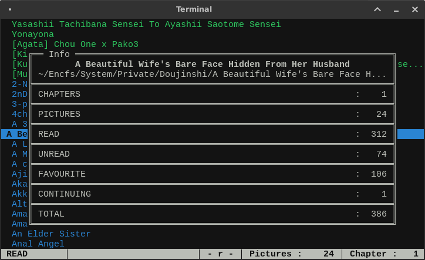

# track

<center>

</center>

## TABLE OF CONTENTS

- [NAME](#NAME)
- [SYNOPSIS](#SYNOPSIS)
- [DESCRIPTION](#DESCRIPTION)
- [OPTIONS](#OPTIONS)
- [ENVIRONMENT VARIABLE](#ENVIRON)
- [FILE ORGANIZATION](#FILE_ORG)
- [TERMINAL USER INTERFACE](#TUI)
- [VERSION](#VERSION)
- [REQUIREMENTS](#REQUIREMENTS)

## NAME<a name="NAME"></a>

track — a simple tool to keep track of your mangas and doujins.

## SYNOPSIS<a name="SYNOPSIS"></a>

**track** \[*OPTIONS*\] \[*ARGS*\]

## DESCRIPTION<a name="DESCRIPTION"></a>
**track** is a program that enables the user to keep track of
mangas and doujins. Most options require the current directory
to be a **permitted** directory, which is any subdirectory
of *$HOLY_DIR*. Without any option provided, this is a **curses**
application and displays the files in the holy directory with a cursor
to move around and some useful keybindings.

The directory *$HOLY_DIR* is also referred to as the **holy directory**.

There are different **tags** for the subdirectories. These are :

-  **READ** : On if subdirectory has been marked as read.
-  **FAVORITE** : On if subdirectory has been marked as favorite.
-  **CONTINUING** : On if subdirectory has a continue point set.

These tags are maintained by creating blank files .READ, .FAV in the
subdirectory. The information for continue point is stored in a file .CONT.

## OPTIONS<a name="OPTIONS"></a>

**-h, --help**

Show a short help message and exit.

**-r, --read**

Toggle the **READ** tag for the current directory, only if the current
directory is a permitted subdirectory.

**-f, --fav**

Toggle the **FAVORITE** tag for the current directory, only if the
current directory is a permitted subdirectory.

**-o** *MODE*, **--open** *MODE*

Open the first page of first chapter of a random subdirectory in the
default image viewer according to *MODE* specified.

The *MODES* are :

- **unread** : Open first page of random **UNREAD** subdirectory.
- **read** : Open first page of random **READ** subdirectory.
- **fav** : Open first page of random **FAVORITE** subdirectory.
- **random** : Open first page of **ANY** random subdirectory.

**-c** *CHAPTER* *PAGE*, **--cont** *CHAPTER* *PAGE*

Set a new continue point for the current permitted subdirectory or
remove an already existing continue point. To set a new continue point,
run the program as :

```
$ track -c [CHAPTER] [PAGE]
```

This will set the continue point to chapter *CHAPTER*, page *PAGE*. If
both *CHAPTER* and *PAGE* are less than or equal to 0, the already existing
continue point is removed. If the chapter is less than or equal to 0 but
the page is not, chapter is assumed to be 1.

**-p, --preview**

Open the first page of the first chapter of the current permitted
subdirectory.

**-s, --status**

Print the status of all the three tags for the current permitted
subdirectory. If the tag is on, a GREEN **tick** mark is printed before
the tag. If it is off, a RED **cross** mark is printed before it.

**--version**

Print version information of program and exit.

## ENVIRONMENT VARIABLE<a name="ENVIRON"></a>
*$HOLY_DIR* needs to be set to the path of the directory where you store your doujins in order for the program to work.
If it is not set, the directory is assumed to be *$HOME/Doujinshi*

## FILE ORGANIZATION<a name="FILE_ORG"></a>
The Doujinshi files need to be organized in a specific manner:
- Each doujinshi should have its own separate subdirectory under *$HOLY_DIR*
- The images inside the subdirectories should be named as "ch\-{chapter} {page}.{ext}" if there are multiple chapters
- For subdirectories with a single chapter, you may name the images as simply "{page}.{ext}"

## TERMINAL USER INTERFACE<a name="TUI"></a>

If no options are provided, **track** is a **curses** application that
displays the files in the holy directory with a cursor to move around
and some useful keybindings. The subdirectories are displayed in
different colors according to their tags. The colors are :

-  **CONTINUING** : YELLOW
-  **UNREAD** : GREEN
-  **READ** : BLUE
-  **FAVORITE** : MAGENTA

#### STATUS BAR

There is also a status bar at the bottom of the screen with information
about the subdirectory under the cursor. At the left, there is the name
of the main section in which the cursor is. Any one of the following :

-  **UNREAD**
-  **READ**
-  **FAVORITE**
-  **CONTINUING**

Then there is information in form of [ - r f ] or [ u - f ]. In this, u
indicates unread, r indicates read and f indicates favorite tag status
for the subdirectory under cursor. If the tag is off, '-' (dash) is
displayed.

Then total number of pictures in the subdirectory under cursor is displayed.
An asterisk (*) at the end of pictures indicates that there are nested
subdirectories. Finally, the number of chapters for that subdirectory
is displayed.

If the subdirectory under cursor has a continue point set, the chapter
and page of the continue point is displayed as [c : *CHAPTER* and p :
*PAGE*] at the end of the cursor.

#### KEYBINDINGS

`j, UP`

Move one row down

`k, DOWN`

Move one row up

`^D, J`

Move half page down

`^U, K`

Move half page up

`g, HOME`

Move to first file

`G, END`

Move to last file

`r`

Toggle **READ** tag for subdirectory under cursor

`f`

Toggle **FAVORITE** tag for subdirectory under cursor

`c`

Set continue point for subdirectory under cursor. First, a textbox with
title "c" will appear in which you need to input chapter number for the
continue point. Then, textbox with title "p" will appear in which you
need to input page number for the continue point. If the continue point
given exists (the subdirectory has that page in that particular
chapter), it is marked. Otherwise, a red flash goes off to inform user
of error. Give 0 or less for both values to remove an already existing
continue point. If chapter is <= 0 but page is not, chapter is
assumed to be 1

`l, RIGHT`

Open first page or continue point (if set) for the subdirectory under
cursor in default image viewer

`p, SPACE`

Open the first page of subdirectory under cursor (regardless of continue
point) in the default image viewer

`/`

Search for term in names of directories after cursor till end of files
(no loopback)

`n`

Go to next file that contains the last search term (no loopback)

`N`

Go to previous file that contains the last search term (no loopover)

`i`

Show the number of subdirectories in each tag and basic information
about subdirectory under cursor

<center>

</center>

`q`

Close info window if visible otherwise, exit

`ESC`

Close info window or text-box if visible

## VERSION<a name="VERSION"></a>

0.1.1

## REQUIREMENTS<a name="REQUIREMENTS"></a>
- Python 3.6+
- xdg-open
- [termcolor](https://pypi.org/project/termcolor/)
